# CHO-Talents 프로젝트 구성도 및 프로세스 흐름도

작성 기준: 2026-06-29 KST 현재 코드 기준 (v3.55.0)
대상 배포: https://cho-talents.github.io/CHO-Talents/  
문서 목적: 다음 검토자가 프로젝트 목적, 화면 구성, 권한 구조, 주요 데이터 흐름, 검증 지점을 빠르게 파악하도록 한다.

## 1. 프로젝트 목적

CHO-Talents는 초등부 달란트 운영을 위한 정적 웹 기반 관리 시스템이다. 학생과 교사는 본인의 달란트 잔액, 구매 내역, Q&A, 상점 상품을 확인하고 구매 신청을 하며, 부서 담당 교사 이상 운영자는 사용자, 부서, 상품, 구매, 달란트 지급/사용/반환, 질문, 보고서, 로그를 관리한다.

| 목적 | 설명 |
|---|---|
| 역할별 화면 분리 | 사용자 권한에 따라 필요한 메뉴와 화면만 표시한다. |
| 달란트 운영 관리 | 적립/사용/반환 내역과 잔액을 `profiles`, `talent_transactions` 중심으로 관리한다. |
| 상품 구매 시스템 | 4단계 구매 흐름(신청→준비→구매→지급)으로 상품 교환을 관리하며, 되돌리기와 구매 취소(cancelled)도 가능하다. 취소는 RPC 우선 시도 + .select() 기반 결과 검증으로 안전하게 처리된다. |
| 승인 기반 계정 운영 | 신규 사용자는 신청 후 관리자 승인으로 계정이 생성된다. |
| 부서 이동 관리 | 부서 변경은 요청→승인 흐름으로 처리한다 (90등급 이상은 즉시 이동). |
| 운영 추적 | 로그인, 인증/권한 리디렉트, 오류, 관리 작업을 로그로 남기고 오류 로그를 확인 처리한다. (v3.40.0부터 PAGE_VIEW 비활성화) |
| Slack 알림 | 부서별/유형별 채널로 구매/가입/부서이동/WARN+ 로그/Q&A 등 운영 이벤트를 Edge Function 경유 분리 전송한다. |
| 코드 마스터 | 권한/유형/상태/카테고리/로그 액션 같은 구분값을 `code_groups`, `code_items`, `js/codes.js`로 통합 관리한다. |
| 에러 한글화 | 영문 DB/RPC 에러를 `tErr()` 함수로 한글 변환하여 사용자에게 표시한다. |
| 보안 강화 | Supabase Auth, RLS, SECURITY DEFINER RPC로 민감 데이터 접근을 제한한다. |

## 2. 전체 시스템 구성

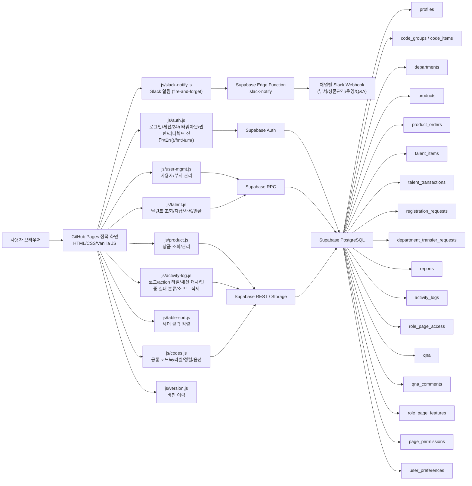

## 3. 폴더 및 파일 구성

목록 페이징은 사용자 관리, 달란트 관리, 달란트 관리 상세 이력, 상품 관리, 달란트 통계, 구매 관리, 구매 통계, 로그, 작업 이력, 보고서, 내 구매 상품, 달란트 수령 최근 내역, 달란트 항목, 달란트 QR, 관리자 관리, 부서 관리 등에서 PC 20개/모바일 10개 기본값을 사용하며, `js/page-size.js`로 그리드별 3~30개 사용자 설정(`user_preferences.page_sizes`)을 지원합니다. 현재 페이지 번호가 강조 표시되고, 7개를 초과하는 페이지는 예시 규칙에 따라 말줄임표로 축약됩니다. 모달 이력도 같은 `renderPageSizeSelector()`와 `buildPagingButtons()`를 사용합니다.

| 경로 | 역할 |
|---|---|
| `index.html` | 메인 진입 화면. 학생 가이드, Q&A, 상점, 로그인, 적립 안내, 내 달란트로 이동. 동적 로그인/로그아웃 버튼. 로그인 사용자는 `⭐ 즐겨찾기 설정`으로 바로가기 카드 커스터마이징 (`user_preferences` DB 저장, 비로그인은 localStorage 폴백). 모바일/PC 모두 최대 10개, 권한에 맞는 메뉴만 표시 |
| `login.html` | 통합 로그인. 성공/실패 로그 기록. 승인 대기/거부 계정 구분 안내 |
| `register.html` | 계정 등록 신청. 영문/숫자/`_`/`-` 아이디 중복확인 후 승인 대기 등록 |
| `guide.html` | 학생 가이드. 사이트 이용 흐름을 카드/스텝 중심으로 안내. 소개 메뉴의 단일 `가이드` 항목은 비로그인/학생에게 이 페이지로 연결 |
| `teacher-guide.html` | 교사 가이드. 일반 교사(40+) 이상만 접근 가능, 미만 시 학생 가이드로 리다이렉트 |
| `dept-teacher-guide.html` | 부서 담당 교사 가이드. 담당 부서 사용자/달란트/상품/구매/Q&A 관리와 일반 교사가 없는 부서에서 해야 할 일 안내 |
| `purchase-teacher-guide.html` | 구매 담당 교사 가이드. 전체 부서 구매 주문 처리, 구매 통계, Slack 구매 알림 기준 안내 |
| `chief-teacher-guide.html` | 부장 교사 가이드. 학생 일괄 등록, 보고서/버전, 달란트 반환, 운영 룰 문서 열람 안내 |
| `evangelist-guide.html` | 전도사님 가이드. 달란트 항목, QR, 상품 삭제, Q&A 삭제, 부서 비활성화 안내 |
| `admin-guide.html` | 관리자 가이드. 부서 담당 교사(60+) 이상만 접근 가능, 운영 권한 전체 요약 |
| `qna.html` | Q&A/FAQ. 공개 FAQ 조회, 관리자 FAQ 직접 등록, 로그인 사용자 질문/답변 등록, 60등급 이상 답변+FAQ 등록, 90등급 이상 삭제 |
| `earn-talents.html` | 달란트 적립 방법 안내. 항목 카드 그리드(모바일 3열, PC 5열)와 `talent_items` 활성 항목 지급 수량 배지 표시. 로그인 사용자의 `user_type`에 따라 학생/교사 탭 기본 선택 |
| `shop.html` | 상점 조회 + 구매 신청 + 대리 구매. 비로그인은 학생용, 교사는 교사용 기본 필터 |
| `talent-receive.html` | 로그인 사용자 QR 달란트 수령. 카메라 스캔 또는 코드 입력, 대상/기간/시간/반복/위치 조건 검증, 최근 수령 내역 페이징. 카메라 스캔 결과 메시지는 카메라 영역 위에 표시하며 위치 권한 차단 시 alert와 `QR_LOCATION_PERMISSION_BLOCKED` 로그를 남김 |
| `my-talents.html` | 로그인 사용자 본인의 사용 가능 달란트/상품 수령 예정/사용 대기/사용 완료/반환/누적 적립 달란트, 달란트 내역(적립·사용·반환 3종 배지), 구매 내역. `fetchTalentSummary()`의 `returned` 필드로 반환 요약 표시. 지급 취소 이력의 트랜잭션 ID는 숨김 |
| `my-orders.html` | 로그인 사용자 본인의 구매 신청 내역과 4단계 상태 조회. 공통 페이징과 페이지당 항목 수 설정 |
| `admin/index.html` | 60등급 이상 대시보드. 사용자/부서/보고서/가입대기 통계 카드. 미확인 ERROR+ 카드는 100등급 이상만 표시(클릭→로그). 최근 이슈 로그 테이블(100등급+) |
| `admin/users.html` | 60등급 이상 사용자 관리. 상단 통계 카드(전체/관리자/부서 담당/교사/학생) 클릭 필터. 관리자=admin+evangelist+chief, 부서 담당=purchase_teacher+dept_teacher. 교사/학생 그룹별 분리(학생은 권한 열 제거). 관리 드롭다운. 가입 신청/부서 이동 요청/승인 처리. 공통 페이징(PC 20/모바일 10) |
| `admin/departments.html` | 60등급 이상 부서 관리. 부서명 오름차순 정렬, 공통 페이징과 페이지당 항목 수 설정. 관리 드롭다운(소속보기/수정/삭제). 부서별 인원(교사 전체 포함)/담당자 확인. 소속보기에서 100등급+는 마지막 로그인 일시 표시 |
| `admin/managers.html` | 80등급 이상 관리자 계열 권한 관리. 수정만 가능. 구매 담당 교사 역할명 표시. 공통 페이징(PC 20/모바일 10) |
| `admin/talents.html` | 40등급 이상 달란트 처리. 출석 버튼+관리 드롭다운(달란트 지급/상세). 잔여 달란트→달란트 명칭 변경. 사용/누적 달란트 모바일 숨김. 목록과 상세 모달 이력 모두 공통 페이징/페이지당 항목 수 설정 사용. 지급 취소 항목 트랜잭션 ID는 100등급+만 표시. 수동 적립은 100등급(관리자)만 표시 |
| `admin/talent-stats.html` | 60등급 이상 달란트 누적적립 통계. 반환(`type='use'`, `description`이 `반환:`)된 달란트를 원 지급 건에서 차감해 실제 지급 달란트로 집계. 부서별 기본 정렬: 달란트 DESC → 인원 ASC → 항목 ASC → 부서 ASC. 사용자별 기본 정렬: 달란트 DESC → 항목 ASC → 부서 ASC → 이름 ASC. 사용자별 목록 공통 페이징과 페이지당 항목 수 설정. 라디오 필터, 부서 필터, 기간 프리셋 |
| `admin/talent-items.html` | 60등급 이상 달란트 지급 항목 관리. 지급 규칙/설명 관리, ⚡퀵 버튼 지정은 80등급 이상. 공통 페이징(PC 20/모바일 10) |
| `admin/talent-qr.html` | 90등급 이상 QR 코드 생성(qrcode.js 이미지)/수정(새 코드 재생성)/비활성화. 지급 대상(학생/교사) 구분, 유효기간 라디오(지정일 날짜+시간/기간/무기한), 반복 수령(none/daily/weekday/week_weekday), 위치 제한(카카오맵 API, 반경 100m~5km, 기본 500m, Geolocation 검증). 검색/필터(대상/조건), 날짜 from-to 범위 필터(초기값 오늘, 오늘/1주/1달/1년 프리셋). QR 목록과 수령자 팝업 모두 페이징+표시개수 설정(qr_list, qr_scan_list 키)+개별 스캔 단위 반환 감지 |
| `admin/shop.html` | 60등급 이상 상품 관리. 교사/학생 그룹별 분리+공통 페이징(PC 20/모바일 10). 카테고리 열 맨 왼쪽, 대상 열 삭제. 상품 등록/수정 모달에서 `products.category` 새 카테고리 추가 가능. 관리 드롭다운(수정/삭제). 삭제는 소프트 삭제 |
| `admin/purchases.html` | 60등급 이상 구매 관리. 칸반보드 형태 상태별 카드(개수 실시간 표시)+일괄 처리 버튼(일괄 준비/구매 확정). 관리 드롭다운. 부서/기간 필터(기본 1주) + 기간 프리셋, 4단계 구매 흐름 + 되돌리기(↩). 공통 페이징(PC 20/모바일 10) |
| `admin/purchase-stats.html` | 60등급 이상 구매 통계. 전체/부서별/사용자별/유형별 4개 탭. 교사/학생 분리 표시. 섹션별 페이징과 페이지당 항목 수 설정. 부서별은 부서 ASC, 사용자별은 부서 ASC → 개수 DESC → 이름 ASC, 유형별은 상품 ASC → 상태 ASC. 부서 필터+유형 필터+기간 필터(기본 1주). 부서 담당 교사는 담당 부서만 조회, 부장 교사 이상 전체 조회 |
| `admin/reports.html` | 80등급 이상 보고서 조회/등록/수정/삭제. 페이지당 항목 수 콤보는 필터 줄 아래 우측에 배치 |
| `admin/logs.html` | 100등급 이상 로그 조회/확인/소프트 삭제 대기 처리. action 열 한글 라벨 표시(`getActionLabel`). 기본 조회 범위 1년 + 기간 프리셋(오늘/1주/1달/1년). 공통 페이징과 페이지당 항목 수 설정. 행 개수 콤보는 삭제 대기 목록 버튼 줄 우측에 배치 |
| `admin/versions.html` | 80등급 이상 버전 이력 확인 |
| `admin/page-access.html` | 100등급 이상 유형/권한별 페이지 접근/요소 가시성 설정 |
| `admin/page-features.html` | 100등급 이상 권한별 페이지 기능 설정값 관리 |
| `admin/audit.html` | 100등급 이상 관리 작업 이력 조회 (기본 조회 범위 1년 + 기간 프리셋(오늘/1주/1달/1년), 자동 조회, 10개 카테고리 필터, 한글 작업 유형 라벨). 공통 페이징(PC 20/모바일 10) |
| `admin/page-permissions.html` | 100등급 페이지 권한 매트릭스 관리 (레거시, 직접 주소 접근) |
| `admin/change-password.html` | 로그인 사용자 비밀번호 변경 |
| `css/` | 테마(`themes.css`), 메인(`style.css`), 공통(`common.css`), 관리자(`admin.css`) 스타일 |
| `js/codes.js` | 권한/유형/상태/카테고리/로그 액션 공통 코드북. DB `code_items`가 있으면 활성 코드의 라벨, 정렬, 색상, 이모지, rank 메타를 우선 적용 |
| `js/slack-notify.js` | Slack 알림 공통 유틸리티. `sendSlackNotify(type, data)`로 Edge Function `slack-notify` 호출. fire-and-forget, 동일 알림 5초 throttle. 부서/유형별 채널 라우팅은 Edge Function에서 수행 |
| `js/` | 테마(`theme.js`), 네비게이션(`nav.js` - `#navHeaderActions` 내부 햄버거·테마·로그인/로그아웃, 처리 가능 건수 배지 + Q&A 미답변 배지 자동 호출 포함), 코드북(`codes.js`), 페이지 크기(`page-size.js`), Slack 알림(`slack-notify.js`), Supabase 설정, 인증/24h 세션 타임아웃/tErr, 로그, 사용자/달란트/상품/버전 모듈 |
| `docs/edge-function-slack-notify.ts` | Supabase Edge Function `slack-notify` 배포용 소스. 부서별/유형별 Webhook Secret 동적 선택, Slack Block Kit 메시지 포맷 |
| `admin/slack-rules.html` | 80등급 이상 Slack 알림 룰 문서. 구매/가입/부서이동/Q&A/WARN+ 로그 알림 type과 채널 라우팅 설명 |
| `docs/SLACK_NOTIFICATION_RULES.md` | Slack 알림 type, 라우팅, Secret 기준 문서 |
| `docs/SUPABASE_NEW_PROJECT_SETUP.md` | 다른 Supabase 프로젝트에서 새로 시작하기 위한 설치 절차 |
| `docs/` | 작업 기록, SQL 스키마, 구성 문서, 사용자 안내서, Edge Function 소스 |

## 4. 권한 구조

현재 권한은 `permission_level`을 숫자 등급으로 환산해 비교한다. `user_type`은 학생/교사 구분이고, 실제 화면 접근은 `permission_level`이 결정한다. v3.50.0부터 권한 라벨과 rank 메타는 `profiles.permission_level`, 사용자 유형 라벨은 `profiles.user_type` 코드 그룹을 기준으로 관리한다.

| 권한 | 코드 | 등급 | 기본 이동 | 설명 |
|---|---|---:|---|---|
| 최고 관리자 | `admin` + `is_super_admin` | 110 | `index.html` | 관리자 포함 전체 사용자 관리, 시스템 설정, 보고서 초기화 |
| 관리자 | `admin` | 100 | `index.html` | 전체 운영 관리, 페이지 접근/기능/감사/로그 관리 |
| 전도사님 | `evangelist` | 90 | `index.html` | 달란트 항목/상품 삭제, 부서 즉시 이동, 전체 구매 처리 |
| 부장 교사 | `chief` | 80 | `index.html` | 대시보드, 부서, 관리자, 보고서, 버전, 달란트 반환 — txnId 기반 1회 제한 (사용자/관리자 관리 조회 전용) |
| 구매 담당 교사 | `purchase_teacher` | 70 | `index.html` | 부서 담당 교사와 동일, 구매 관리에서 전체 부서 주문 처리 |
| 부서 담당 교사 | `dept_teacher` | 60 | `index.html` | 담당 부서 사용자/달란트/상품/구매/Q&A 관리 |
| 일반 교사 | `teacher` | 40 | `index.html` | 담당 부서/반 학생 달란트 처리, 대리 구매, 교사용/학생용 상점 |
| 학생 | `student` | 20 | `index.html` | 내 달란트, 내 구매 상품, Q&A 질문, 학생용 상점, 구매 신청 |
| 비로그인 | 없음 | 0 | 공개 페이지 | 메인, 학생 가이드, Q&A FAQ, 적립 안내, 학생용 상점, 계정 신청 |

권한 제어 기준:

| 기준 | 구현 위치 | 내용 |
|---|---|---|
| 페이지 진입 | `initPage(minRank, loginPath)` | 로그인, 최초 비밀번호 변경, 최소 등급을 확인 |
| 메뉴 노출 | `data-min-perm`, `applyPermNav()` | 현재 등급보다 높은 메뉴는 숨김 |
| 권한 비교 | `js/codes.js`, `PERMISSION_RANK`, `get_permission_rank()` | DB `code_items.meta.rank` 우선, 미설치 DB에서는 기본 코드북/폴백으로 `super_admin:110`부터 `student:20`까지 숫자 비교 |
| 사용자 관리 | `admin_update_user`, `admin_delete_user` 등 RPC | 상위 권한자/최고관리자 보호 |
| 페이지 접근 | `role_page_access` | `initPage()`에서 보조 확인. 페이지 최소 등급을 통과한 뒤 요소 숨김 설정을 적용 |
| 페이지 기능 | `role_page_features` | 권한별 기능 설정값 관리 테이블. 현재 공통 런타임 차단은 `data-min-perm`, 직접 rank 체크, RLS/RPC가 담당 |
| 데이터 접근 | Supabase RLS | 익명/저권한 직접 조회 제한 |

네비게이션 배지 기준:

| 배지 | 표시 위치 | 호출 권한 | 계산 기준 |
|---|---|---:|---|
| 관리 배지 | 관리 > 사용자 관리 | 60+ | 해당 계정이 처리 가능한 가입 신청 + 부서 이동 요청 수 |
| 상품 배지 | 상품 > 구매 관리 | 60+ | 해당 계정이 처리 가능한 구매 건수. 구매 담당 교사는 전체 부서 주문 포함 |
| 운영 배지 | 운영 > 로그 | 80+ 호출, 로그 화면 접근은 100+ | 미확인 ERROR/FATAL/CRITICAL 로그 수 |

### 네비게이션 DOM 구조 (v3.48.0)

`js/nav.js`의 `renderNav()`가 생성하는 헤더 액션 영역 구조:

| 순서 | 요소 | ID/클래스 | 역할 |
|---:|---|---|---|
| 1 | 브랜드 | `.admin-nav-brand` | `index.html` 링크 |
| 2 | 헤더 액션 | `#navHeaderActions` | 테마·햄버거·로그인/로그아웃·사용자명 |
| 2a | 테마 피커 | `#navThemePicker` | 다크/라이트 전환 |
| 2b | 햄버거 | `#navHamburger` | 모바일 메뉴 토글 (`navLinks.nav-open`) |
| 2c | 로그아웃 | `#navLogoutBtn` | 로그인 시 표시 |
| 2d | 로그인/사용자 | `#navLoginArea`, `#navAuthArea` | 비로그인/로그인 영역 |
| 3 | 메뉴 링크 | `#navLinks` | 드롭다운 메뉴 그룹 |

v3.48.0부터 햄버거 버튼(`.nav-hamburger`)은 `#navHeaderActions` **내부**에 렌더링된다. 이전처럼 네비게이션 최상위 형제가 아니라, 테마 스위치·로그아웃·사용자명과 같은 액션 묶음에 포함된다.

v3.51.0부터 소개 메뉴의 역할별 가이드 링크는 단일 `가이드` 항목으로 통합되었다. `js/nav.js`의 `_navGuideHrefForSession()`이 세션의 `permissionLevel`/`isSuperAdmin`에 따라 학생, 교사, 부서 담당, 구매 담당, 부장, 전도사님, 관리자 가이드 중 하나로 연결한다.

모바일(`max-width: 768px`) CSS `order` 배치 (`css/common.css`):

| order | 요소 |
|---:|---|
| 1 | `.admin-nav-brand` |
| 2 | `#navHeaderActions` (테마 → 햄버거 → 로그아웃 → 사용자명) |
| 3 | `#navLinks` (햄버거 클릭 시 `.nav-open` 토글) |

## 5. 화면 연결 구조

```mermaid
flowchart TD
  Public["공개 영역"] --> Home["index.html"]
  Public --> Guide["guide.html"]
  Public --> TeacherGuide["teacher-guide.html<br/>40+"]
  Public --> DeptGuide["dept-teacher-guide.html<br/>60+"]
  Public --> PurchaseGuide["purchase-teacher-guide.html<br/>70+"]
  Public --> ChiefGuide["chief-teacher-guide.html<br/>80+"]
  Public --> EvangelistGuide["evangelist-guide.html<br/>90+"]
  Public --> AdminGuide["admin-guide.html<br/>60+"]
  Public --> QNA["qna.html"]
  Public --> Earn["earn-talents.html"]
  Public --> Shop["shop.html"]
  Public --> Login["login.html"]
  Public --> Register["register.html"]

  Home --> Guide
  Home --> QNA
  Home --> Earn
  Home --> Shop
  Home --> MyTalents["my-talents.html"]
  Home --> MyOrders["my-orders.html"]
  Login --> Password{"최초 로그인?"}
  Password -->|예| ChangePassword["admin/change-password.html"]
  Password -->|아니오| Home

  Home --> AdminDash["admin/index.html<br/>60+"]
  Home --> Users["admin/users.html<br/>60+"]
  Home --> Departments["admin/departments.html<br/>60+"]
  Home --> Managers["admin/managers.html<br/>80+"]
  Home --> Talents["admin/talents.html<br/>40+"]
  Home --> TalentItems["admin/talent-items.html<br/>60+"]
  Home --> AdminShop["admin/shop.html<br/>60+"]
  Home --> Purchases["admin/purchases.html<br/>60+"]
  Home --> Reports["admin/reports.html<br/>80+"]
  Home --> Versions["admin/versions.html<br/>80+"]
  Home --> PageAccess["admin/page-access.html<br/>100+"]
  Home --> PageFeatures["admin/page-features.html<br/>100+"]
  Home --> Audit["admin/audit.html<br/>100+"]
  Home --> Logs["admin/logs.html<br/>100+"]
  Home -.-> PagePerms["admin/page-permissions.html<br/>100+ 직접 주소 접근"]
```

## 6. 로그인 및 세션 흐름

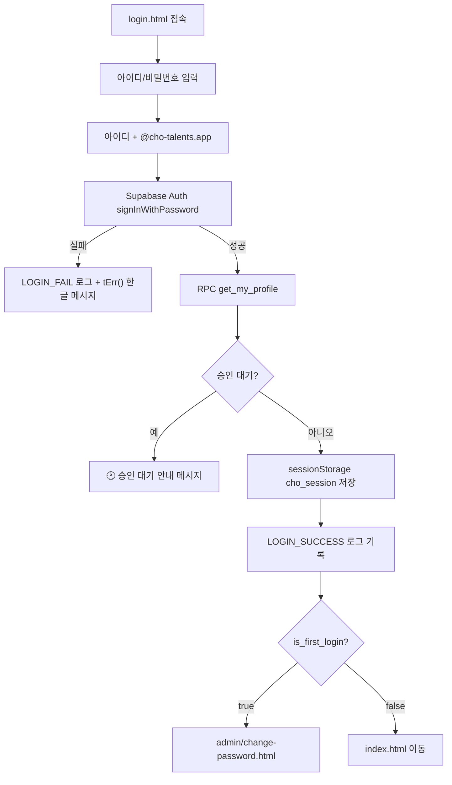

보호 페이지는 `initPage()`에서 다음 순서로 처리한다.

1. Supabase Auth 세션 확인
2. 세션이 없거나 Auth 오류가 있으면 `AUTH_SESSION_MISSING`과 `AUTH_REDIRECT` 로그를 남기고 로그인 페이지로 이동
3. 프로필/권한 로드 (세션 캐시 활용). 프로필 RPC 실패 시 `AUTH_PROFILE_LOAD_FAIL` 기록
4. 최초 로그인 상태면 `AUTH_REDIRECT` 로그를 남기고 비밀번호 변경 화면으로 이동
5. 최소 권한 미달이면 `AUTH_REDIRECT` 로그를 남기고 `index.html`로 이동
6. `role_page_access` 확인: DB 접근 차단 시 `AUTH_REDIRECT`, 조회 실패 시 `AUTH_PAGE_ACCESS_CHECK_FAIL` 기록
7. 통과 시 `auth-ready` 적용, 역할 배지/메뉴/페이지 데이터 로드
8. `startSessionTimer()` 호출 — 24시간 유휴 세션 타임아웃 시작 (v3.48.0)

`AUTH_REDIRECT` details에는 요청 페이지, `detectCurrentPageId()` 결과, 이동 대상, 사용자, 권한, 권한등급, 필요권한등급/허용권한, 세션 실패 상세가 들어간다. 로그인 필수 페이지가 간헐적으로 `index.html`로 보이는 경우는 대부분 `initPage()`의 권한 미달/허용 권한 불일치/DB 페이지 접근 차단에서 `getRedirectUrl()`이 권한별 기본 화면(`index.html`)을 반환했기 때문이다. 세션 없음/만료는 `login.html` 이동과 `AUTH_SESSION_MISSING` 로그로 구분한다.

### 24시간 세션 타임아웃 (v3.48.0)

`js/auth.js`에 세션 타이머 모듈이 포함되어 있다. DB 스키마 변경 없이 클라이언트 `localStorage`로 마지막 활동 시각을 추적한다.

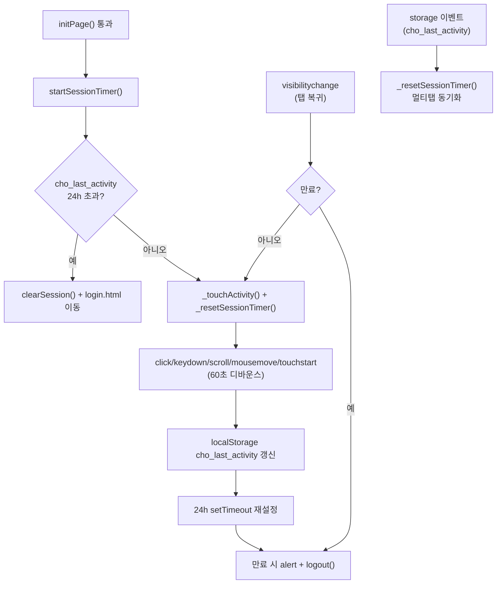

| 항목 | 값/동작 |
|---|---|
| 상수 | `SESSION_TIMEOUT_MS = 24 * 60 * 60 * 1000` (24시간) |
| 저장 키 | `localStorage` `cho_last_activity` (Unix ms) |
| 시작 시점 | `initPage()` 성공 후 `auth-ready` 적용 직후 |
| 활동 이벤트 | `click`, `keydown`, `scroll`, `mousemove`, `touchstart` |
| 디바운스 | 60초 — 연속 이벤트 폭주 방지 |
| 탭 복귀 | `visibilitychange`에서 만료 재검증, 미만료 시 활동 갱신 |
| 멀티탭 | `storage` 이벤트로 다른 탭의 활동 갱신 시 타이머 동기화 |
| 만료 처리 | `AUTH_REDIRECT`에 만료 기준(`idle_timer`, `last_activity`, `visibilitychange`) 기록 후 alert 안내/`logout()` → 로그인 페이지 이동 |

### 메인 페이지 즐겨찾기 흐름

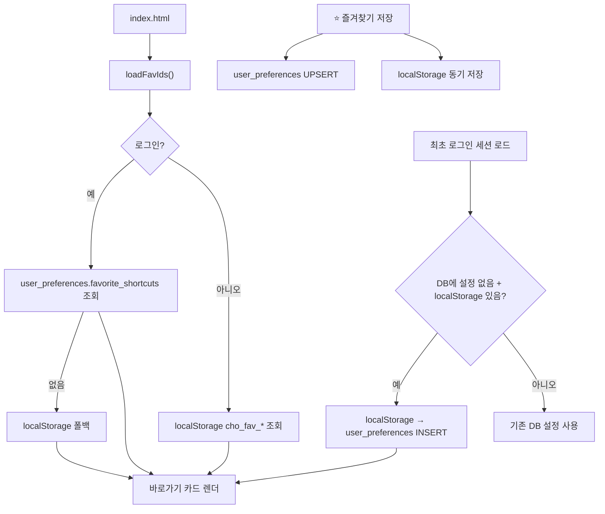

- 로그인 사용자: `user_preferences` 테이블에서 즐겨찾기 로드/저장 (RLS 적용)
- 비로그인: `localStorage`만 사용 (폴백)
- 최초 로그인 시: DB에 설정이 없고 `localStorage`에 기존 데이터가 있으면 자동 마이그레이션
- 즐겨찾기 후보와 실제 렌더링은 네비게이션 권한 규칙과 동일하게 필터링되며, 권한 밖 항목은 자동 제외된다

## 7. 신규 계정 신청 흐름

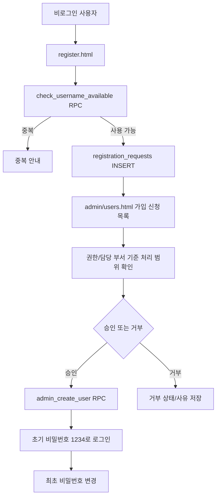

가입 신청 처리 권한:

| 권한 | 조회 | 처리 |
|---|---|---|
| 관리자/전도사님 | 전체 신청 | 전체 처리 |
| 부장 교사 | 전체 신청 | 담당 부서만 처리 |
| 부서 담당 교사 | 담당 부서만 | 담당 부서만 처리 |

## 8. 사용자/부서/관리자 관리 흐름

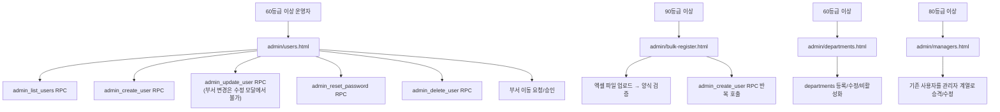

### 부서 이동 흐름

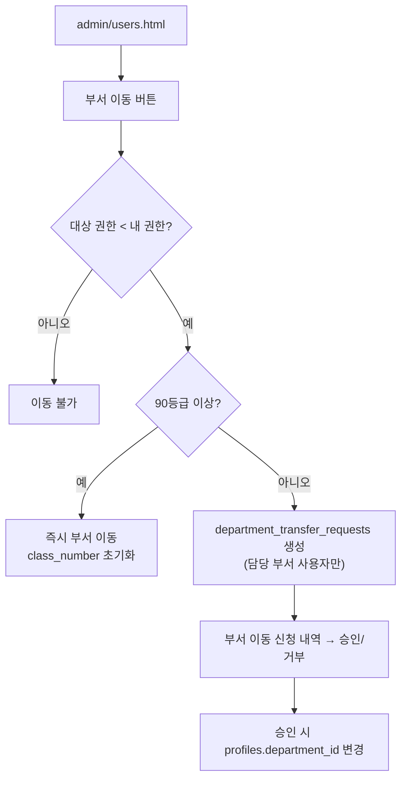

운영 제약:

| 항목 | 기준 |
|---|---|
| 사용자 등록/수정/삭제 | 본인보다 낮은 등급만 가능. 실제 검증은 RPC에서 수행 |
| 부서 담당 교사(60~79) 사용자 관리 | `canManageUser()`: 담당 부서 소속 학생의 반 수정·비밀번호 초기화 가능. 삭제·부서 이동은 80+ |
| 아이디 표시 | 관리자에게만 전체 노출. 그 외에는 본인 아이디만 표시 |
| 동명이인 | 같은 이름/유형/부서면 `①`, `②` 번호를 붙여 구분 표시 |
| 최고관리자 | `is_super_admin` 사용자는 삭제/수정 보호 |
| 담당 부서 | 관리 권한 계열은 담당 관리 부서를 지정할 수 있음 |
| 부서 스코핑 | 90등급 미만은 담당 부서 사용자만 조회. 담당 부서 없으면 빈 목록 |

## 9. 달란트 처리 흐름

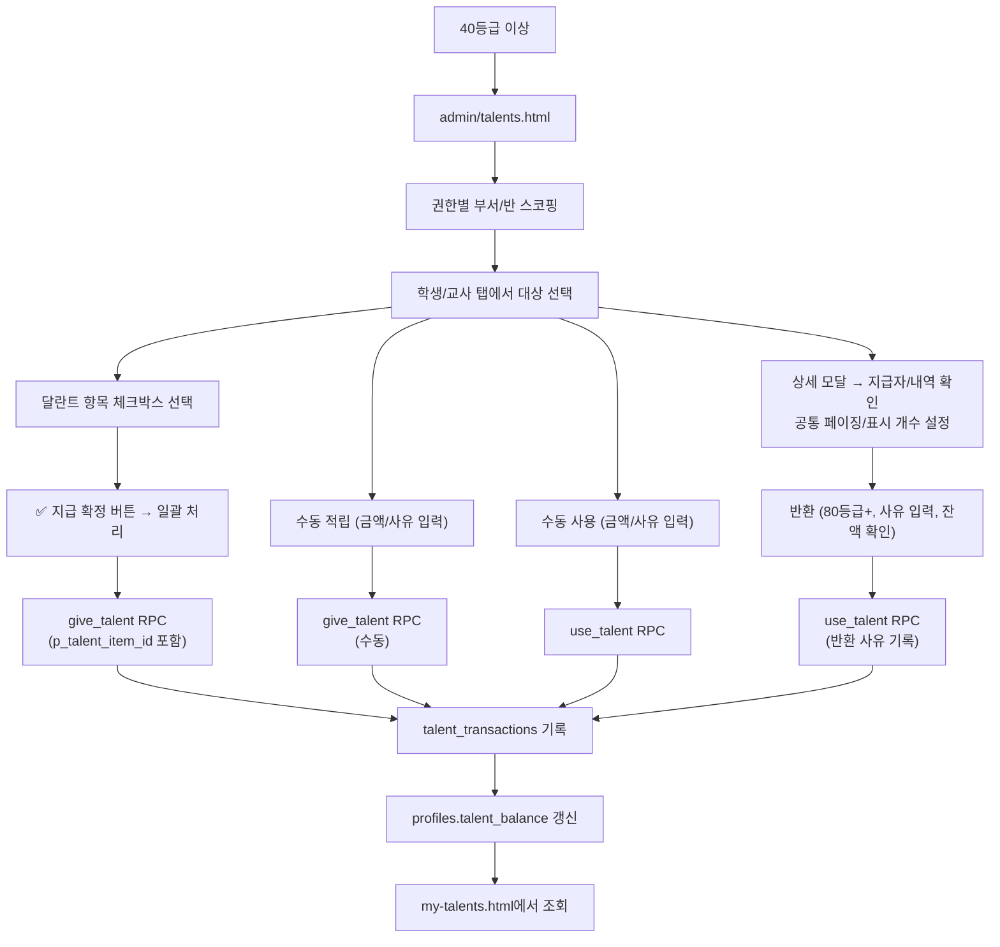

### 달란트 반환 구분 (v3.48.0)

반환 트랜잭션은 DB상 `type='use'`로 저장되며, `description`이 `반환:`으로 시작한다. `fetchTalentSummary()`가 `used`와 `returned`를 프론트엔드에서 분리 집계한다. **DB 스키마/RPC 변경 없음.**

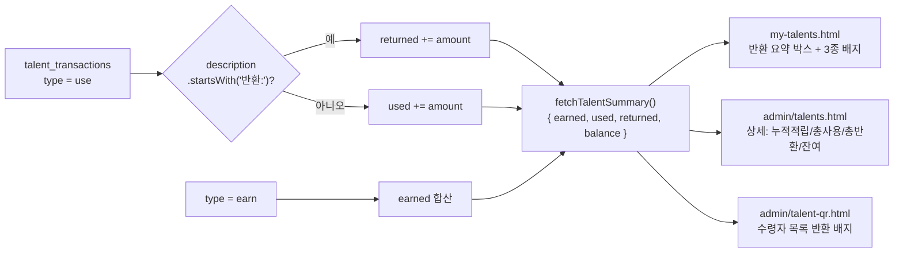

| 화면 | 반환 표시 |
|---|---|
| `my-talents.html` | 반환 요약 박스, 내역 테이블 `반환` 배지, 사용 완료는 실제 상품 구매만 |
| `admin/talents.html` | 상세 모달 4칸(누적적립/총사용/총반환/잔여) |
| `admin/talent-qr.html` | 수령자 팝업: 개별 스캔 단위 `반환` 배지 (talent_item_id + 시간 근접 매칭), 페이징, 표시 개수 설정 |

반환 기록 시 `use_talent` RPC의 `p_description`은 `'반환: ' + description` 형식으로 저장한다.

달란트 지급 규칙:

| 항목 | 내용 |
|---|---|
| 지급 방식 | 체크박스 선택 + 일괄 확정 |
| 출석 버튼 | 테이블 각 행에 '출석' 버튼 → 클릭 즉시 출석 달란트 지급 (주간 중복 방지) |
| 이미 지급된 항목 | 이번 주(월~일) 지급 여부 자동 표시 |
| 반환 | 80등급(부장 교사) 이상, 사유 필수, 잔여 > 0일 때만 |
| 지급자 기록 | `created_by` 필드에 지급자 ID 저장, 상세 모달에서 확인 |
| 에러 처리 | RPC 성공/실패/거부 모두 activity_logs에 기록 |

## 10. 상품 및 구매 흐름

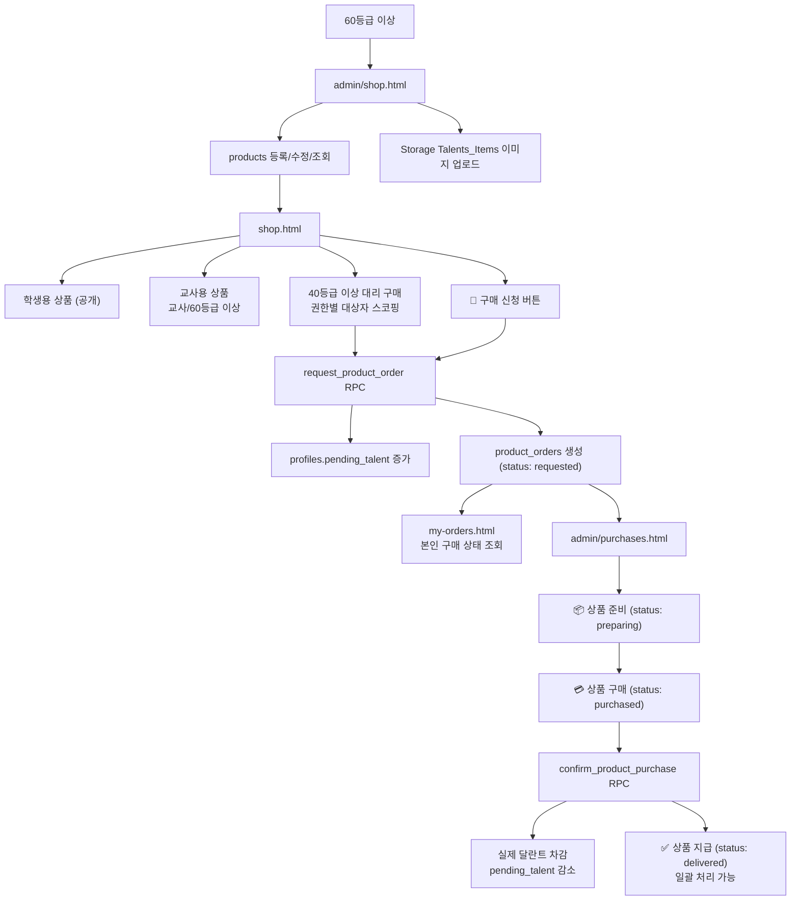

상품 구매 흐름에서 `products.target_role`, `products.category`, `product_orders.status`는 코드 마스터 기준으로 표시한다. 상점, 상품 관리, 내 구매 상품, 구매 관리, 구매 통계는 같은 `products.category`와 `product_orders.status` 코드 그룹을 사용하므로 라벨, 색상, 정렬 순서가 동일하다. 상품 등록/수정 모달의 카테고리 추가 패널은 `code_items(group_key='products.category')`에 새 행을 넣고, 성공 시 브라우저 코드북을 즉시 갱신해 새 카테고리를 선택한다.

구매 관리 권한:

| 권한 | 조회 범위 | 처리 범위 |
|---|---|---|
| 부서 담당 교사 | 담당 부서 신청 | 담당 부서 신청의 준비/구매 확정/지급 처리 |
| 구매 담당 교사 | 전체 신청 | 전체 처리 가능 |
| 부장 교사 | 전체 신청 | 담당 관리 부서 신청 처리 |
| 전도사님 이상 | 전체 신청 | 전체 처리 가능 |

상품 정책:

| 항목 | 기준 |
|---|---|
| 학생용 상품 | 비로그인도 조회 가능 |
| 교사용 상품 | 로그인한 교사 또는 60등급 이상만 조회 |
| 교사 기본 필터 | 교사 접속 시 교사용 탭 자동 선택 |
| 상품 등록/수정 | 60등급 이상 |
| 상품 카테고리 추가 | 60등급 이상. `docs/TASK-058_product_category_policy.sql`의 `code_items_product_category_insert` 정책으로 `products.category` INSERT만 허용 |
| 상품 삭제 | 90등급 이상. 소프트 삭제(삭제 대기=비활성화) - 목록에서 숨김 |
| 구매 신청 | 로그인 사용자 (잔여 달란트 확인) |
| 대리 구매 | 40등급 이상. 권한별 부서/반/사용자 범위 제한 |

## 11. 보고서 및 로그 흐름

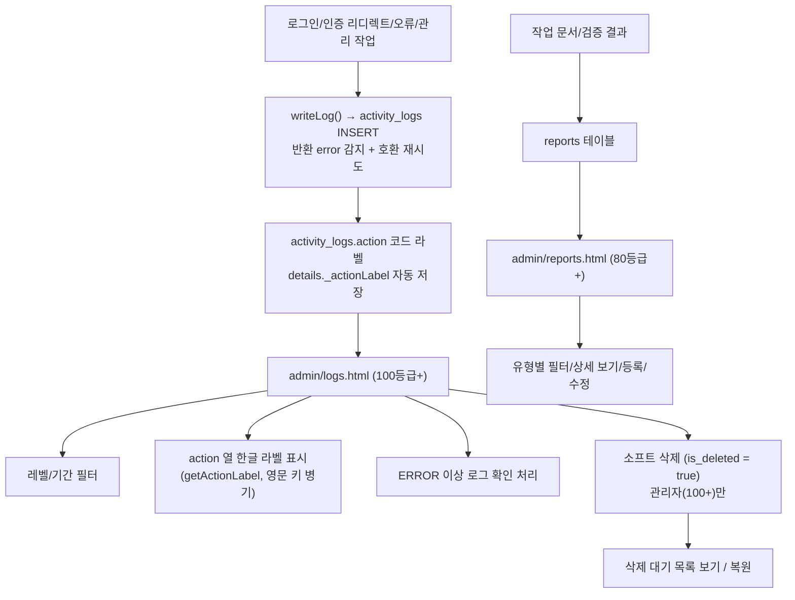

로그 레벨: `TRACE`, `DEBUG`, `INFO`, `WARN`, `ERROR`, `FATAL`, `CRITICAL`

- v3.40.0부터 `autoLogPageView()`는 no-op이며 PAGE_VIEW 로그를 기록하지 않는다 (함수 호출은 각 페이지에 유지)
- v3.53.0부터 인증/권한 원인 분석용 action을 구분한다: `AUTH_SESSION_MISSING`, `AUTH_PROFILE_LOAD_FAIL`, `AUTH_REDIRECT`, `AUTH_PAGE_ACCESS_CHECK_FAIL`, `QR_LOCATION_PERMISSION_BLOCKED`.
- v3.54.0부터 상품 등록 모달에서 새 카테고리를 추가하면 `PRODUCT_CATEGORY_CREATE`를 기록하고, 실패 시 `PRODUCT_CATEGORY_CREATE_FAIL`/`PRODUCT_CATEGORY_CREATE_ERROR`를 기록한다.
- `AUTH_REDIRECT`는 로그인 필수 페이지가 로그인 화면 또는 `index.html`로 이동한 원인을 추적하기 위한 로그이며, 세션 없음/만료, 최초 로그인, 권한 등급 부족, 허용 권한 불일치, DB 페이지 접근 차단을 구분한다.
- `activity-log.js`의 `getActionLabel()`은 `js/codes.js`/DB `activity_logs.action` 코드 그룹을 우선 사용하고, 기존 로그의 `details._actionLabel`을 하위호환 라벨로 함께 사용한다
- `writeLog()`는 기록 시 action 라벨이 있으면 `details._actionLabel`에 한글 라벨을 자동 저장한다
- `writeLog()`는 Supabase insert 결과의 `error`를 확인하고, 구버전 DB 스키마에서 `user_name`/`is_acknowledged` 컬럼 오류가 나면 해당 선택 컬럼을 제거해 재시도한다
- `admin/logs.html`은 `getActionLabel()`로 action 열에 한글 라벨을 표시한다 (영문 키 병기)
- `ERROR`, `FATAL`, `CRITICAL`은 기본적으로 미확인 상태로 저장
- 운영자가 확인 내용을 남기면 확인 처리
- 로그 삭제는 소프트 삭제(`is_deleted=true`) 방식
- 로그/작업 이력 조회 시 `is_deleted`가 `NULL`인 기존 데이터도 함께 표시하도록 하위호환 처리
- 실제 삭제는 관리자가 SQL Editor에서 직접 실행: `DELETE FROM activity_logs WHERE is_deleted = true;`
- 전체 기능의 성공/실패/거부가 `logInfo`/`logWarn`/`logError`로 기록됨

## 12. 작업 이력(감사) 흐름

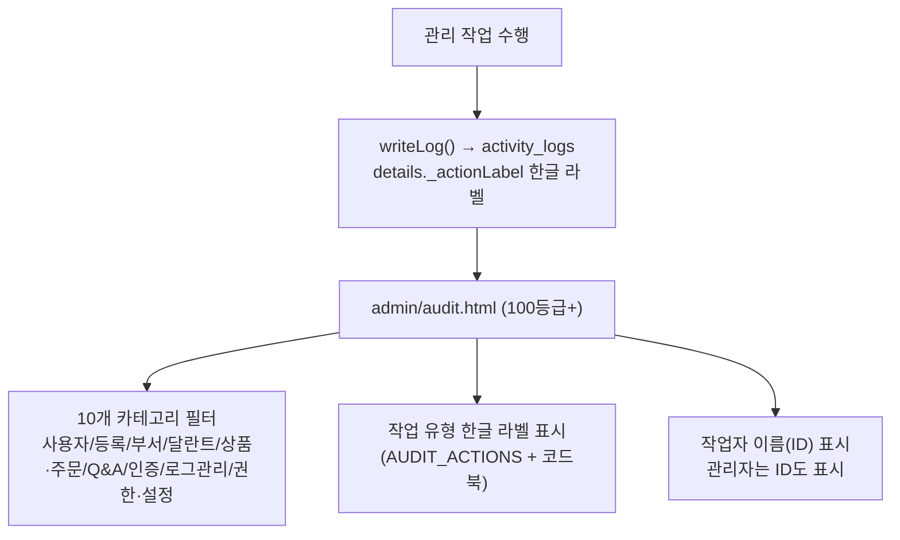

- `AUDIT_ACTIONS`는 기본 정의와 `activity_logs.action` 코드 그룹을 함께 사용해 70개 이상 관리 작업 action 키와 한글 라벨/카테고리를 표시한다
- 작업 이력 화면은 10개 카테고리 필터(전체 + 9개 그룹)로 조회 범위를 좁힌다
- 작업 이력은 별도 테이블이 아니라 `activity_logs`에서 `AUDIT_ACTIONS` 키에 해당하는 로그만 필터링한다
- 상세 내역은 `writeLog()`가 저장한 `details._actionLabel` 및 한글화된 details 키를 표시한다

## 13. Slack 알림 흐름

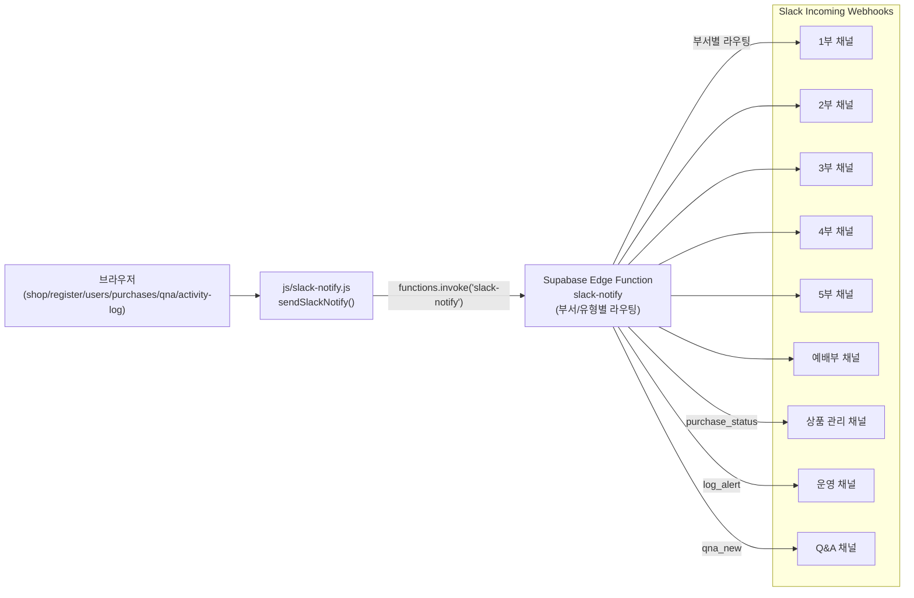

채널 라우팅 규칙:

| 알림 유형 | 라우팅 기준 | 대상 채널 |
|---|---|---|
| `user_register` | 신청 부서명 (data.부서) | 해당 부서 채널 |
| `dept_transfer` | 이동 대상 부서명 (data.이동부서) | 해당 부서 채널 |
| `purchase_new` | 신청자 소속 부서명 (data.부서) | 해당 부서 채널 |
| `purchase_status` | requested→preparing 전환만 | 상품 관리 채널 |
| `log_alert` | WARN/ERROR/FATAL/CRITICAL | 운영 채널 |
| `qna_new` | 항상 | Q&A 채널 |

Edge Function Secrets:

| Secret Name | 용도 |
|---|---|
| `SLACK_WEBHOOK_PART1` ~ `PART5` | 1부~5부 부서별 |
| `SLACK_WEBHOOK_WORSHIP` | 예배부 |
| `SLACK_WEBHOOK_PRODUCT_MANAGEMENT` | 상품 관리 |
| `SLACK_WEBHOOK_OPERATIONS` | 운영 로그 |
| `SLACK_WEBHOOK_ANSWER` | Q&A |

구현 메모:

- `js/slack-notify.js`: Supabase 클라이언트(`_sb`)가 초기화된 페이지에서만 동작. 실패 시 콘솔 경고만 출력하고 사용자 흐름은 차단하지 않음
- `docs/edge-function-slack-notify.ts`: Supabase Dashboard > Edge Functions에 배포. 9개 Webhook Secret 설정 필요 (기존 `SLACK_WEBHOOK_URL`은 제거)
- Edge Function은 type + data(부서명) 기반으로 적절한 Webhook Secret을 선택하여 POST
- 부서명이 매핑되지 않거나 Secret이 미설정인 경우 알림은 스킵됨 (에러 아님)

## 14. 에러 처리 흐름

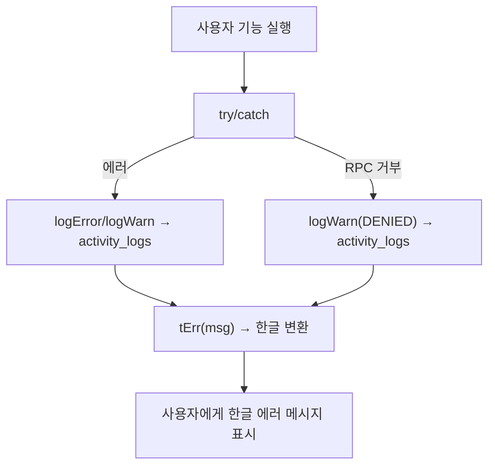

`tErr()` 함수는 25개 이상의 정규식 패턴으로 영문 DB/RPC 에러를 한글로 변환한다. 이미 한글인 메시지는 그대로 반환한다.

## 15. 주요 Supabase 리소스

| 리소스 | 용도 |
|---|---|
| `code_groups`, `code_items` | 권한/유형/상태/카테고리/로그 액션 등 코드 마스터. `code_items.meta`에 rank, color, emoji, category 같은 표시/검증 메타 저장 |
| `profiles` | 사용자 유형, 권한, 부서, 반, 달란트 잔액, 사용 대기 달란트(`pending_talent`), 마지막 로그인(`last_login_at`) |
| `user_preferences` | 사용자별 즐겨찾기 바로가기 설정(JSONB), 테마(`theme`), 그리드별 페이지 크기(`page_sizes` JSONB), RLS 적용 |
| `departments` | 부서명, 설명, 반 개수, 활성 상태 |
| `registration_requests` | 가입 신청/승인/거부 |
| `department_transfer_requests` | 부서 이동 요청/승인/거부 |
| `talent_items` | 달란트 지급 항목 (학생용/교사용 구분), 지급 규칙(`giving_rule`), 지급 설명(`giving_description`) |
| `talent_transactions` | 달란트 적립/사용/반환 내역. `created_by`로 지급자 추적 |
| `products` | 상점 상품. `target_role`, `category`는 코드 마스터 기준 구분값 |
| `product_orders` | 구매 신청/4단계 상태 관리/담당자 기록. `status`는 코드 마스터 기준 |
| `qna` | FAQ, 사용자 질문, 답변, 공개 여부, 소프트 삭제 |
| `qna_comments` | Q&A 질문별 댓글(답변) 스레드 |
| `reports` | 작업 보고서 |
| `talent_qr_codes` | QR 코드 생성/관리. `target_type`(학생/교사), `valid_from`/`valid_until` 기간 또는 지정일 시간 범위, `max_uses` (0=무제한, N=선착순), `location_*` 위치 제한(100m~5km, 기본 500m), `repeat_type`(none/daily/weekday/week_weekday), `repeat_days` INT[], `repeat_weeks` INT[] |
| `talent_qr_scans` | QR 코드 스캔 이력. 반복 수령 시 오늘 기준 중복 체크 |
| `activity_logs` | 활동/오류 로그. `is_deleted`/`deleted_at` 소프트 삭제, `user_name` 기록, `action` 코드 라벨과 `details._actionLabel` 한글 라벨. 작업 이력도 이 테이블을 필터링해 표시 |
| `role_page_access` | 권한 등급별 페이지 접근/요소 가시성 설정 |
| `role_page_features` | 권한 등급별 페이지 기능 설정값 |
| `page_permissions` | 페이지 권한 설정 (레거시) |
| `Talents_Items` | 상품 이미지 Storage 버킷 |

## 16. 주요 RPC

| RPC | 목적 |
|---|---|
| `get_my_profile` | 로그인 사용자 프로필/권한 조회 |
| `update_last_login` | 로그인 성공 시 `profiles.last_login_at` 갱신 |
| `check_username_available` | 가입 신청 아이디 중복확인 |
| `check_registration_status` | 미승인/거부 계정 로그인 안내 조회 |
| `admin_list_users` | 사용자 목록 조회 |
| `admin_create_user` | Auth 사용자와 profile 생성 |
| `admin_update_user` | 사용자 정보/권한 수정 |
| `admin_delete_user` | 사용자 삭제 |
| `admin_reset_password` | 비밀번호 `1234` 초기화 |
| `change_my_password` | 본인 비밀번호 변경 및 최초 로그인 해제 |
| `give_talent` | 달란트 적립. 수동 지급과 `p_talent_item_id` 기반 항목 지급에 사용 |
| `use_talent` | 달란트 사용 및 반환 사유 기록 |
| `request_product_order` | 상품 구매 신청 (사용 대기 달란트 관리) |
| `confirm_product_purchase` | 상품 구매 확정 (실제 달란트 차감) |
| `cancel_product_order` | 구매 신청 상태 주문 취소와 사용 대기 달란트 복원 |
| `scan_qr_talent` | QR 수령 처리, 스캔 기록, `talent_transactions.source='qr'` 기록 |
| `submit_anonymous_question` | 비로그인 Q&A 질문 등록 |
| `admin_soft_delete_qna` | 전도사님 이상 Q&A 소프트 삭제 |
| `get_public_app_config` | 공개 런타임 설정 조회 |

## 17. 빠른 검증 체크리스트

1. `login.html`에서 로그인 성공/실패 메시지가 한글로 표시되는지 확인한다.
2. 승인 대기 계정 로그인 시 "승인 대기 중" 안내가 구분 표시되는지 확인한다.
3. 최초 로그인 사용자가 `admin/change-password.html`로 강제 이동하는지 확인한다.
4. 일반 로그인 성공 후 `index.html`로 이동하고 권한별 메뉴만 표시되는지 확인한다.
5. 비로그인 상태에서 `my-talents.html`이 로그인으로 이동하는지 확인한다.
6. 비로그인 `shop.html`에서 학생용 상품만 조회되는지 확인한다.
7. 교사 로그인 후 `shop.html`에서 교사용 탭이 기본 선택되는지 확인한다.
8. 40등급 이상 대리 구매 대상자 목록이 권한 범위 안에서만 표시되는지 확인한다.
9. 상품 구매 신청 시 `pending_talent`이 증가하고 달란트가 즉시 차감되지 않는지 확인한다.
10. `my-orders.html`에서 본인 구매 신청 상태만 조회되는지 확인한다.
11. `admin/purchases.html`에서 4단계 구매 흐름이 정상 작동하는지 확인한다.
12. 40등급 이상이 `admin/talents.html`에서 체크박스 일괄 지급이 되는지 확인한다.
13. 80등급 이상만 달란트 반환이 가능한지 확인한다.
14. 부서 이동이 수정 모달이 아닌 부서 이동 버튼으로만 되는지 확인한다.
15. 60등급 이상이 `admin/users.html`, `admin/shop.html`, `admin/purchases.html`을 사용할 수 있는지 확인한다.
16. 60등급 이상이 대시보드를, 80등급 이상이 관리자, 보고서, 버전 화면을 사용할 수 있는지 확인한다.
17. 100등급 이상만 `admin/page-access.html`, `admin/page-features.html`, `admin/audit.html`, `admin/logs.html`에 접근 가능한지 확인한다.
18. 80등급 이상이 `docs/page-permission-rules.html`, `admin/log-rules.html`, `admin/slack-rules.html`, `admin/audit-rules.html`에 접근 가능한지 확인한다.
19. 소개 메뉴에 `가이드` 항목 하나만 표시되고, 비로그인은 학생 가이드, 로그인 사용자는 권한별 가이드(교사/부서 담당/구매 담당/부장/전도사님/관리자)로 연결되는지 확인한다.
20. `qna.html`에서 공개 FAQ, 로그인 질문 등록, 60등급 이상 댓글(답변)/FAQ 등록/직접 FAQ 추가, 90등급 이상 삭제가 동작하는지 확인한다.
21. 아이디가 관리자에게만 표시되고 일반 사용자는 본인 것만 보이는지 확인한다.
22. 에러 메시지가 한글로 변환되어 표시되는지 확인한다.
23. 주요 기능의 성공/실패/거부가 활동 로그에 기록되는지 확인하고, DB insert 실패가 콘솔 오류로 노출되는지 확인한다.
24. `my-talents.html`에서 반환 달란트 요약과 적립/사용/반환 3종 배지가 올바르게 표시되는지 확인한다.
25. 24시간 유휴 후(또는 `cho_last_activity` 수동 조작) 세션 만료 시 alert와 로그아웃 리다이렉트가 동작하는지 확인한다.
26. 모바일 뷰에서 `#navHeaderActions` 내부 햄버거가 테마·로그아웃·사용자명과 함께 우측에 배치되는지 확인한다.

## 18. 다음 작업자가 먼저 볼 파일

| 우선순위 | 파일 | 이유 |
|---:|---|---|
| 1 | `README.md` | 현재 구조, 페이지 연결, 권한, 운영 흐름 요약 |
| 2 | `docs/PROJECT_ARCHITECTURE_FLOW.md` | 상세 구성도와 프로세스 흐름 |
| 3 | `js/codes.js` | 권한/유형/상태/카테고리/로그 액션 코드북, DB `code_items` 로드, 라벨/정렬/옵션 공통 함수 |
| 4 | `js/auth.js` | 권한 등급, 리디렉트, Supabase 세션, 24h 유휴 타임아웃(`startSessionTimer`), tErr() 에러 번역 |
| 5 | `js/activity-log.js` | 로그 기록, action 한글 라벨, writeLog() 자동 라벨, WARN+ Slack 알림 연동, Q&A 미답변 배지, 세션 캐시, 소프트 삭제 |
| 5a | `js/slack-notify.js` | Slack 알림 공통 유틸리티, Edge Function slack-notify 호출, 채널 라우팅은 Edge Function 측 |
| 5b | `docs/edge-function-slack-notify.ts` | Edge Function 배포 소스, 부서별/유형별 Webhook Secret 동적 선택, Slack Block Kit 포맷 |
| 5c | `docs/SLACK_NOTIFICATION_RULES.md`, `admin/slack-rules.html` | Slack 알림 type과 채널 라우팅 운영 문서 |
| 6 | `js/user-mgmt.js` | 사용자/부서 관리 RPC |
| 7 | `js/talent.js` | 달란트 지급/사용/반환, `fetchTalentSummary()` earned/used/returned 분리 집계 |
| 8 | `js/product.js` | 상품 조회/관리, 상품 대상/카테고리 코드 라벨 |
| 9 | `admin/*.html` | 각 관리 화면의 실제 접근 권한과 UI 동작 |
| 10 | `docs/TASK-026_schema.sql` | 구매 시스템 DB 스키마 및 RPC |
| 11 | `docs/TASK-032_fixes.sql` | Q&A 테이블/RLS와 미승인 로그인 안내 RPC |
| 12 | `docs/TASK-035_qna_comments.sql` | Q&A 댓글 테이블/RLS 및 삭제 권한 수정 |
| 13 | `docs/TASK-039_user_preferences.sql` | `user_preferences` 테이블 (즐겨찾기 DB 저장), RLS 정책 |
| 14 | `docs/TASK-047_activity_logs_grants.sql` | 운영 DB `activity_logs` INSERT 권한/정책 복구 SQL |
| 15 | `docs/TASK-048_schema.sql` | v3.36.0: talent_items 컬럼, purchase_teacher CHECK 제약 |
| 16 | `docs/TASK-049_schema.sql` | v3.37.0: profiles.last_login_at, update_last_login RPC |
| 17 | `docs/TASK-041_page_sizes.sql` | v3.40.0: user_preferences.page_sizes JSONB 컬럼 |
| 18 | `docs/TASK-052_super_admin_update_fix.sql` | v3.45.0: admin_update_user RPC에서 is_super_admin 호출자 rank 110 처리 |
| 19 | `docs/TASK-057_code_master.sql` | v3.50.0: `code_groups`/`code_items`, 코드 컬럼 검증 트리거, `get_permission_rank()` 코드화 |
| 20 | `docs/INITIAL_DATABASE_SETUP.sql`, `docs/SUPABASE_NEW_PROJECT_SETUP.md` | 새 Supabase 프로젝트 초기 설치 통합 SQL과 실행 절차 |

## 19. 개발 주의사항

### 파일 인코딩

모든 소스 파일은 **UTF-8 (BOM 없음)**. PowerShell의 `Set-Content`, `Out-File`, `>` 리다이렉션은 인코딩을 변환하므로 **사용 금지**. 대량 치환은 `[System.IO.File]::ReadAllBytes` / `WriteAllBytes` 조합만 허용.

### Git 머지 충돌

충돌 마커(`<<<<<<<`, `=======`, `>>>>>>>`)가 남으면 HTML 파싱 실패 → 사이트 전체 동작 불가. 머지 후 반드시 전 파일 마커 검색 필수.

### 신규 Admin 페이지 생성 시 필수 스크립트

`admin/*.html` 신규 페이지를 만들 때 아래 순서를 반드시 지킨다. **순서가 틀리거나 누락되면 세션 인식 실패 → 로그인 리다이렉트 무한 루프 발생.**

```html
<script src="https://cdn.jsdelivr.net/npm/@supabase/supabase-js@2"></script>
<script src="../config/public-config.js?v=VERSION"></script>
<script src="../js/supabase-config.js?v=VERSION"></script>
<script src="../js/activity-log.js?v=VERSION"></script>   <!-- auth.js보다 먼저! -->
<script src="../js/codes.js?v=VERSION"></script>          <!-- 권한/상태/라벨 코드북 -->
<script src="../js/auth.js?v=VERSION"></script>
<script src="../js/theme.js?v=VERSION"></script>
<script src="../js/nav.js?v=VERSION"></script>
```

인라인 `<script>` 첫 줄에 `initSupabase();` 호출 필수. 누락 시 `_sb=null` → `loadAuthSession()` 즉시 null 반환.

| 체크 항목 | 누락 시 증상 |
|-----------|-------------|
| Supabase CDN | `window.supabase` 미정의 → initSupabase 실패 |
| public-config.js | Supabase URL/Key 로드 불가 |
| activity-log.js 순서 | loadAuthSession 미정의 → initPage 에러 |
| codes.js 순서 | 권한/상태/카테고리 라벨 폴백 누락 → 하드코딩 라벨만 표시 |
| initSupabase() | _sb=null → 세션 인식 불가 → 리다이렉트 |
